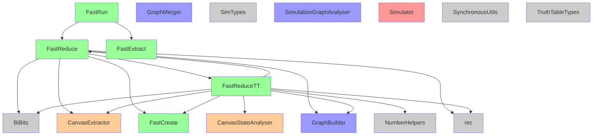
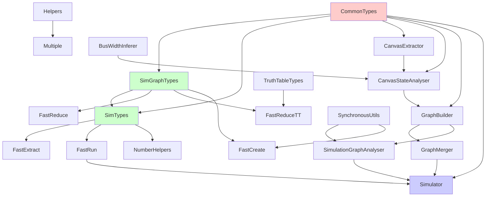

# Simulator API Documentation

## 1. Simulator Module Overview

### Module Structure and Namespaces

The Simulator module is organized under the `src/Renderer/Simulator` directory with the following hierarchy:

```
Simulator/
├── Core Types and Utilities
│   ├── SimTypes.fs                  - Core simulation types and data structures
│   ├── SimGraphTypes.fs             - Graph types and algebraic expressions
│   ├── TruthTableTypes.fs          - Truth table specific types
│   ├── NumberHelpers.fs            - Number conversion and formatting utilities
│   └── BiBits.fs                   - Experimental bit manipulation (unused)
├── Canvas Processing
│   ├── CanvasExtractor.fs          - Extract circuit from UI canvas
│   ├── CanvasStateAnalyser.fs      - Validate circuit structure
│   └── GraphBuilder.fs             - Build simulation graph from canvas
├── Graph Processing
│   ├── GraphMerger.fs              - Merge hierarchical component graphs
│   ├── SimulationGraphAnalyser.fs  - Detect cycles and validate graphs
│   └── SynchronousUtils.fs         - Support for clocked components
├── Main Simulator
│   └── Simulator.fs                - Main simulation orchestration
└── Fast Simulation Engine
    ├── FastCreate.fs               - Create optimized simulation structures
    ├── FastExtract.fs              - Extract data from simulation
    ├── FastReduce.fs               - Core component evaluation logic
    ├── FastReduceTT.fs             - Truth table evaluation variant
    └── FastRun.fs                  - Simulation execution and scheduling
```

### Main Functionality and Design Philosophy

The Simulator module implements a **high-performance digital circuit simulator** with the following core principles:

1. **Immutable-to-Mutable Transformation**: UI state is immutable, but simulation uses mutable arrays for performance
2. **Hybrid Simulation**: Supports both concrete numeric simulation and symbolic algebraic simulation
3. **Hierarchical Circuit Support**: Handles custom components with dependency resolution
4. **Cycle-Accurate Simulation**: Synchronous component support with proper clock domain handling
5. **Optimization-First Design**: Multiple optimization paths for different bit widths and component types

### Key F# Features Used

- **Recursive Modules**: `module rec SimGraphTypes` for mutually recursive type definitions
- **Discriminated Unions**: Extensive use for type safety (e.g., `FData`, `FastBits`, `FastAlgExp`)
- **Active Patterns**: Pattern matching for component types and algebraic expressions
- **Type Providers**: JavaScript interop for canvas state
- **Computation Expressions**: Implicit use in result handling pipelines
- **Optics/Lenses**: Functional updates for immutable data structures
- **Inline Functions**: Performance optimization for hot paths

## 2. Type Definitions Documentation

### Core Data Types

#### FastData (SimGraphTypes.fs)
```fsharp
type FastData = {
    Dat: FastBits
    Width: int
}
```
**Purpose**: Efficient representation of digital bus data with automatic width handling.

#### FastBits (SimGraphTypes.fs)
```fsharp
type FastBits = 
    | Word of uint32        // For widths ≤ 32 bits
    | BigWord of bigint     // For widths > 32 bits
```
**Purpose**: Optimized storage for different bit widths.

#### FData (SimTypes.fs)
```fsharp
type FData = 
    | Data of FastData      // Concrete numeric value
    | Alg of FastAlgExp     // Algebraic expression
```
**Purpose**: Unified type for both numeric and symbolic simulation.

#### FastAlgExp (SimGraphTypes.fs)
```fsharp
type FastAlgExp =
    | SingleTerm of SimulationIO
    | DataLiteral of FastData
    | UnaryExp of Op: UnaryOp * Exp: FastAlgExp
    | BinaryExp of Exp1: FastAlgExp * Op: BinaryOp * Exp2: FastAlgExp
    | ComparisonExp of Exp: FastAlgExp * Op: ComparisonOp * bigint
    | AppendExp of FastAlgExp list
    // ... more cases
```
**Purpose**: Abstract syntax tree for algebraic expressions in symbolic simulation.

#### SimulationComponent (SimGraphTypes.fs)
```fsharp
type SimulationComponent = {
    Id: ComponentId
    Type: ComponentType
    Label: ComponentLabel
    Inputs: (InputPortNumber * WireData) list
    Outputs: (OutputPortNumber * WireData) list
    CustomSimulationGraph: SimulationGraph option
    State: SimulationComponentState
}
```
**Purpose**: Component representation in simulation graph.

#### FastComponent (SimTypes.fs)
```fsharp
type FastComponent = {
    fId: FComponentId
    cId: ComponentId
    FType: ComponentType
    SheetName: string
    fInputs: IOArray array
    fOutputs: IOArray array
    fIsVerbose: bool
    OutputWidth: int array
    InputWidth: int array
    State: SimulationComponentState
    Big: bool
    BigState: BigIntState option
    // ... additional fields
}
```
**Purpose**: Optimized component representation for fast simulation.

#### FastSimulation (SimTypes.fs)
```fsharp
type FastSimulation = {
    SimulatedComponentIds: ComponentId list
    SimulatedComponents: FastComponent array
    FComps: Map<FComponentId, FastComponent>
    FIOActive: Map<string, FComponentId>
    WaveIndex: WaveIndexT array
    // ... additional fields
}
```
**Purpose**: Complete simulation state with component arrays and indexing.

### Algebraic and Numeric Types

#### BinaryOp (SimGraphTypes.fs)
```fsharp
type BinaryOp = 
    | Add | Sub | Mult | Div | Mod
    | BitAnd | BitOr | BitXor | BitLShift | BitRShift
    | LogicalAnd | LogicalOr
```
**Purpose**: Binary operations in algebraic expressions.

#### UnaryOp (SimGraphTypes.fs)
```fsharp
type UnaryOp = 
    | Neg | Not
    | BitRange of int * int
    | CarryOfAdder
```
**Purpose**: Unary operations in algebraic expressions.

## 3. Public Functions and Value Bindings

### Main Simulation API

<!-- Key Functions Status (Updated 2025-07-11 07:12:17) -->
**Key Functions Verification:**
- ✓ `startCircuitSimulation` - Found in Simulator (public)
- ✓ `buildFastSimulation` - Found in FastRun (public)
- ✓ `stepSimulation` - Found in FastRun (private)
- ✓ `fastReduce` - Found in FastReduce (public)


#### startCircuitSimulation
```fsharp
val startCircuitSimulation : 
    int -> string -> CanvasState -> LoadedComponent list -> 
    Result<SimulationData, SimulationError>
```
**Purpose**: Initialize simulation with concrete numeric data.
**Parameters**: 
- `maxArraySize`: Maximum simulation steps
- `diagramName`: Name of circuit to simulate
- `canvasState`: Circuit definition
- `loadedComponents`: Custom component definitions
**Side Effects**: Creates mutable simulation arrays
**Example**:
```fsharp
canvasState
|> startCircuitSimulation 1000 "MyCircuit"
|> Result.map (fun simData -> simData.FastSim)
```

#### startCircuitSimulationFData
```fsharp
val startCircuitSimulationFData : 
    int -> string -> CanvasState -> LoadedComponent list -> 
    Result<SimulationData, SimulationError>
```
**Purpose**: Initialize simulation with support for algebraic expressions.
**Parameters**: Same as `startCircuitSimulation`
**Side Effects**: Creates mutable simulation arrays with algebraic support
**Pure Function**: No (creates mutable state)

#### validateCircuitSimulation
```fsharp
val validateCircuitSimulation : 
    string -> CanvasState -> LoadedComponent list -> 
    Result<SimulationGraph, SimulationError>
```
**Purpose**: Validate circuit structure without creating simulation.
**Parameters**: 
- `diagramName`: Circuit name
- `canvasState`: Circuit definition
- `loadedComponents`: Custom components
**Pure Function**: Yes
**Example**:
```fsharp
validateCircuitSimulation "TestCircuit" canvasState ldcs
|> Result.map (fun graph -> graph.Count)
```

### Graph Building Functions

#### runCanvasStateChecksAndBuildGraph
```fsharp
val runCanvasStateChecksAndBuildGraph : 
    CanvasState -> LoadedComponent list -> 
    Result<SimulationGraph, SimulationError>
```
**Purpose**: Build simulation graph from canvas state with validation.
**Parameters**: Canvas state and loaded components
**Side Effects**: None (pure function)
**Example**:
```fsharp
runCanvasStateChecksAndBuildGraph canvasState ldcs
|> Result.bind (fun graph -> validateGraph graph)
```

#### getSimulationIOs
```fsharp
val getSimulationIOs : 
    Component list -> SimulationIO list * SimulationIO list
```
**Purpose**: Extract input and output ports from component list.
**Parameters**: List of components
**Returns**: Tuple of (inputs, outputs)
**Pure Function**: Yes

### Fast Simulation Functions

#### buildFastSimulation
```fsharp
val buildFastSimulation : 
    int -> SimulationGraph -> Result<FastSimulation, SimulationError>
```
**Purpose**: Create optimized simulation structure from graph.
**Parameters**: Max array size and simulation graph
**Side Effects**: Creates mutable arrays
**Pure Function**: No (creates mutable state)

#### stepSimulation
```fsharp
val stepSimulation : 
    int -> FastSimulation -> FastSimulation
```
**Purpose**: Advance simulation by one clock cycle.
**Parameters**: Clock number and simulation state
**Side Effects**: Modifies simulation arrays in-place
**Pure Function**: No (mutates arrays)

#### runFastSimulation
```fsharp
val runFastSimulation : 
    int -> int -> FastSimulation -> FastSimulation
```
**Purpose**: Run simulation for multiple clock cycles.
**Parameters**: Start clock, end clock, simulation
**Side Effects**: Modifies simulation arrays
**Pure Function**: No (mutates arrays)

### Data Conversion Functions

#### wireToFast
```fsharp
val wireToFast : WireData -> FastData
```
**Purpose**: Convert bit list to efficient FastData representation.
**Parameters**: Bit list
**Returns**: FastData with appropriate width
**Pure Function**: Yes
**Example**:
```fsharp
[Zero; One; One; Zero] |> wireToFast
```

#### fastToWire
```fsharp
val fastToWire : FastData -> WireData
```
**Purpose**: Convert FastData to bit list.
**Parameters**: FastData
**Returns**: Bit list
**Pure Function**: Yes
**Example**:
```fsharp
fastData |> fastToWire |> List.map bitToString
```

#### convertIntToFastData
```fsharp
val convertIntToFastData : int -> uint32 -> FastData
```
**Purpose**: Convert integer to FastData with specified width.
**Parameters**: Width and value
**Returns**: FastData
**Pure Function**: Yes

#### convertFastDataToBigint
```fsharp
val convertFastDataToBigint : FastData -> bigint
```
**Purpose**: Convert FastData to bigint.
**Parameters**: FastData
**Returns**: bigint value
**Pure Function**: Yes

### Number Formatting Functions

#### fastDataToPaddedString
```fsharp
val fastDataToPaddedString : int -> NumberBase -> FastData -> string
```
**Purpose**: Format FastData as padded string in specified base.
**Parameters**: Width, number base, FastData
**Returns**: Formatted string
**Pure Function**: Yes
**Example**:
```fsharp
fastData |> fastDataToPaddedString 8 Hex
// Returns: "000000FF"
```

#### valToPaddedString
```fsharp
val valToPaddedString : int -> NumberBase -> bigint -> string
```
**Purpose**: Format bigint value as padded string.
**Parameters**: Width, number base, value
**Returns**: Formatted string
**Pure Function**: Yes

## 4. Module Call Relationship Diagram
<!-- Updated by analyzer on 2025-07-11 07:12:17 -->



### Key Function Composition Chains

#### 1. Simulation Initialization Chain
```fsharp
canvasState
|> extractReducedState
|> analyseState loadedComponents
|> Result.bind (runCanvasStateChecksAndBuildGraph loadedComponents)
|> Result.bind (mergeDependencies loadedComponents)
|> Result.bind (buildFastSimulation maxArraySize)
```

#### 2. Component Evaluation Chain
```fsharp
fastComponent
|> getInputs
|> fastReduce
|> updateOutputs
|> propagateToNextComponents
```

#### 3. Data Conversion Pipeline
```fsharp
wireData
|> convertWireDataToFastData
|> performOperation
|> convertFastDataToWireData
|> formatForDisplay
```

### Recursive Call Patterns

#### Tree Traversal (GraphMerger.fs)
```fsharp
let rec mergeDependencies graph loadedComponents =
    match findCustomComponents graph with
    | [] -> graph
    | customs -> 
        customs
        |> List.map (resolveCustomComponent loadedComponents)
        |> List.fold mergeIntoGraph graph
        |> mergeDependencies loadedComponents
```

#### Expression Evaluation (SimGraphTypes.fs)
```fsharp
let rec evalExp expr =
    match expr with
    | FAlgDataExp data -> expr
    | FAlgBinaryExp(op, left, right) -> 
        let leftEvaled = evalExp left
        let rightEvaled = evalExp right
        simplifyBinaryOp op leftEvaled rightEvaled
    | FAlgUnaryExp(op, inner) -> 
        let innerEvaled = evalExp inner
        simplifyUnaryOp op innerEvaled
```

## 5. Complete Function List by File
<!-- Updated by analyzer on 2025-07-11 07:12:17 -->
<!-- Note: Private functions are marked with (private) -->

### BiBits.fs
**Module**: `BiBits`

- `addBIBits`
- `appendBIBits`
- `binopBIBits`
- `floatCarryBit`
- `getBIBit`
- `getBIBits`
- `getBIBitsInt`
- `invertBIBits`
- `lowerChunk`
- `lowerWord`
- `lsw`
- `msw`
- `msw1`
- `offset`
- `out`
- `outMSW`
- `outWidth`
- `outWords`
- `outs`
- `upperChunk`
- `width`
- `x`

### CanvasExtractor.fs
**Module**: `CanvasExtractor`

- `addStateToLoadedComponents`
- `byId`
- `compareCanvas`
- `compareComps`
- `compareConns`
- `compareIOs`
- `comparesEqual`
- `comps`
- `comps1`
- `comps2`
- `compsOk`
- `connFixedOffset`
- `connIdA`
- `conns`
- `connsA1`
- `connsA2`
- `connsOk`
- `diff`
- `dx`
- `dy`
- `extractLoadedSimulatorComponent`
- `extractReducedState`
- `getOrderedCompLabels`
- `getStateAndDependencies`
- `inputs`
- `ins`
- `isClose`
- `ldc`
- `ldcIsEq`
- `lengthDiff`
- `loadedComponentIsEqual`
- `loadedComponentIsEqualExInputDefault`
- `loadedComponentIsSameAsProject`
- `logConnId`
- `outputs`
- `parseDiagramSignature`
- `portsEqual`
- `pp`
- `printConnErrors`
- `referenceEquality`
- `sort`
- `sortKey`
- `sortQBy`
- `sq`
- `stateIsEqual`
- `stateIsEqualExInputDefault`
- `verticesAreSame`
- `xy`

### CanvasStateAnalyser.fs
**Module**: `CanvasStateAnalyser`

- `affectedComps`
- `affectedConns`
- `affectedPorts`
- `analyseState`
- `badNameErrors`
- `checkAdderUnnecessaryNC`
- `checkAllPorts`
- `checkComponentNamesAreOk`
- `checkComponentPorts`
- `checkComponentsPorts`
- `checkConnectionPort`
- `checkConnectionsPorts`
- `checkConnectionsWidths (private)`
- `checkConns (private)`
- `checkCounts (private)`
- `checkCustomComponentForOkIOs`
- `checkCustomComponentsOk`
- `checkDuplicate`
- `checkEvery (private)`
- `checkIOLabels (private)`
- `checkPortConnections (private)`
- `checkPortTypesAreConsistent (private)`
- `checkPortsAreConnectedProperly (private)`
- `compOfPort`
- `compare`
- `components`
- `condDisconnected`
- `condSelDisconnected`
- `conns`
- `convertConnId`
- `convertError`
- `countPortsConnections (private)`
- `counts`
- `countsRes`
- `disp`
- `duplicateNameErrors`
- `error`
- `faulty`
- `genMaps (private)`
- `getAllInputPortIds (private)`
- `getAllOutputPortIds (private)`
- `getIdx`
- `getInErrType (private)`
- `getInPortRmInfo (private)`
- `getNCConnectedOutPorts`
- `getOutErrType`
- `getOutPortRmInfo (private)`
- `getPortName`
- `getPortNum`
- `getRmInfoData`
- `idToComp`
- `idToInputPort`
- `idToOutputPort`
- `idx`
- `inouts`
- `inputs`
- `instIns`
- `instOuts`
- `isDAndLoadDisconnected`
- `isEnDisconnected`
- `isNotConnected`
- `key`
- `labComps`
- `labGroup`
- `labInputPorts`
- `labMap`
- `labOutputPorts`
- `labSourceConns`
- `labTargetConns`
- `label`
- `labels`
- `m`
- `name`
- `normalise`
- `normaliseL`
- `otherInputPorts`
- `otherOutputPorts`
- `outputs`
- `pNames`
- `parentComp`
- `port`
- `portName`
- `portNames`
- `portNum`
- `rmInfo`
- `s`
- `sourceIsLabel`
- `splitBy`
- `t`
- `targetIsLabel`
- `toMap`
- `totals`
- `widthErr`

### FastSim/FastCreate.fs
**Module**: `FastCreate`

- `addComponentWaveDrivers`
- `addDriver`
- `addDrivers`
- `addSimSheetNames`
- `addSimSheetPaths`
- `addStepArray`
- `addWaveIndexAndDrivers`
- `addWavesToFastSimulation`
- `addWidth`
- `allComps`
- `ap`
- `apOf`
- `cid`
- `comp`
- `compType`
- `comps`
- `compsInCustomComp`
- `createFastComponent`
- `createFlattenedSimulation (private)`
- `createInitFastCompPhase`
- `ct`
- `customComps`
- `customOutLookup`
- `customSimSheetNames`
- `determineBigIntState`
- `emptyFastSimulation`
- `emptyGather`
- `fComps`
- `fDriven`
- `fId`
- `fc`
- `fcActiveDriver`
- `ff`
- `fid`
- `findBigIntState`
- `gatherSimulation`
- `gatherT`
- `getCustomNameIdsOf`
- `getFid`
- `getLinks`
- `getPortNumbers`
- `getSComp`
- `graph`
- `graphL`
- `inLinks`
- `inPortNum`
- `index`
- `inp`
- `inputs`
- `ins`
- `insideCustomGathers`
- `ioLabelIsActive`
- `labKey`
- `labelKey`
- `labelPartStartIndex`
- `labels`
- `linkFastComponents`
- `linkFastCustomComponentsToDriverArrays`
- `linked`
- `makeFastComp`
- `makeIOArray`
- `makeIOArrayW`
- `makeStepArray`
- `makeWaveIndex`
- `numSteps`
- `out`
- `outLinks`
- `outer`
- `outputs`
- `outs`
- `parent`
- `portNum`
- `reLinkIOLabels (private)`
- `reduceIfHybrid`
- `sComp`
- `sComps`
- `sheetLabel`
- `simSheetNames`
- `simSheetStructure`
- `simulationPlaceholder`
- `start`
- `startTime`
- `state`
- `topGather`
- `waveComps`
- `x`

### FastSim/FastExtract.fs
**Module**: `FastExtract`

- `a`
- `areAllElementsSame`
- `changeInput`
- `changeInputBatch`
- `changeInputFData`
- `compareLoadedStates`
- `comps`
- `evaluated`
- `extractFastSimulationIOs`
- `extractFastSimulationIOsFData`
- `extractFastSimulationOutput`
- `extractFastSimulationOutputFData`
- `extractFastSimulationState`
- `extractFastSimulationWidth`
- `extractStatefulComponents`
- `extractViewers`
- `fc`
- `fd`
- `fs`
- `getArrayOfOutputs`
- `getFLabel`
- `inputs`
- `out`
- `outputarray`
- `outputsAreTheSameAsDefault`
- `setSimulationInput (private)`
- `setSimulationInputFData (private)`
- `slicedArray`
- `viewers`
- `w`
- `width`

### FastSim/FastReduce.fs
**Module**: `FastReduce`
**Dependencies**: BiBits, CanvasExtractor, FastCreate, FastReduceTT, GraphBuilder, rec

- `a`
- `addr`
- `address`
- `addressW`
- `b`
- `bit`
- `bit0`
- `bits`
- `bits0`
- `bits1`
- `cin`
- `componentType`
- `cout`
- `d`
- `data`
- `enable`
- `fastReduce` - Calls: BigIntState, outs, getBitsFromBigInt, getBitsFromBigIntToUInt32, InputWidth (+36 more)
- `fdIn`
- `getRamStateMemory`
- `getRomStateMemory`
- `inputNum`
- `intAddr`
- `intData`
- `lastOut`
- `mask`
- `maxMsb`
- `mem`
- `mergeTwoValues`
- `minusOne`
- `msBits`
- `n`
- `out`
- `out0`
- `outBits`
- `outData`
- `outDataInt`
- `outNum`
- `readMemoryAddrBigIntDataBigInt`
- `readMemoryAddrBigIntDataUInt32`
- `readMemoryAddrUInt32DataBigInt`
- `readMemoryAddrUInt32DataUInt32 (private)`
- `readMemoryFData`
- `res`
- `simStep`
- `simStepOld`
- `sum`
- `sumInt`
- `w`
- `w0`
- `writeMemory`
- `writeMemoryAddrBigIntDataBigInt`
- `writeMemoryAddrBigIntDataUInt32`
- `writeMemoryAddrUInt32DataBigInt`
- `writeMemoryAddrUInt32DataUInt32`

### FastSim/FastReduceTT.fs
**Module**: `FastReduceTT`
**Dependencies**: BiBits, CanvasExtractor, CanvasStateAnalyser, FastCreate, FastReduce, GraphBuilder, NumberHelpers, rec

- `a`
- `aExp`
- `address`
- `b`
- `b0`
- `b1`
- `bit`
- `bits`
- `bits0`
- `bits1`
- `cin`
- `cinExp`
- `componentType`
- `cout`
- `d`
- `data`
- `dataIn`
- `err`
- `exp`
- `exp0`
- `exp1`
- `expi`
- `fDataL`
- `fastReduceFData` - Calls: FullName, ShortId, InputLinks, OutputWidth, FType (+63 more)
- `fd`
- `inBitsAndWidths`
- `inputNum`
- `inputs`
- `io2`
- `isAlgExp`
- `isAllData`
- `lastOut`
- `makeSplitOutput` - Calls: getAlgExpWidth, Width, FullName, bits0, inputs (+44 more)
- `mask`
- `mem`
- `mergeTwoValues`
- `minusOne`
- `n`
- `newExp`
- `numExp`
- `out`
- `out0`
- `out1`
- `outBits`
- `outDat`
- `outData`
- `outNum`
- `res`
- `simStep`
- `simStepOld`
- `sum`
- `sumInt`
- `w`
- `wOut`
- `write`
- `zeros`

### FastSim/FastRun.fs
**Module**: `FastRun`
**Dependencies**: FastExtract, FastReduce

- `activeComps`
- `arraySumBy`
- `attr`
- `buildFastSimulation`
- `buildFastSimulationFData`
- `calculateTotalSimArraySizePerStep`
- `checkAndValidate`
- `checkAndValidateFData`
- `createFastArrays`
- `data`
- `fc`
- `fs`
- `gather`
- `getArrayOf`
- `inSimulationComps`
- `index`
- `init`
- `initClockedOuts`
- `initD`
- `initInput`
- `inputVal`
- `ins`
- `isValidData (private)`
- `isValidFData (private)`
- `maxSimulationTime`
- `numberOfStepsBeforeTimeCheck`
- `orderCombinationalComponents (private)` - Calls: iter, fastReduce, a, MaxArraySize, Touched (+6 more)
- `orderCombinationalComponentsFData (private)`
- `orderedSet`
- `possibleCycleComps`
- `pp`
- `printComp`
- `printComps (private)`
- `propagateEval`
- `propagateInputsFromLastStep (private)`
- `readyL`
- `restartSimulation (private)`
- `runCombinationalLogic`
- `runCombinationalLogicFData`
- `runFastSimulation`
- `setInputstoDefault (private)`
- `simStartTime`
- `start`
- `startTick`
- `startTime`
- `stepSimulation (private)`
- `stepsBeforeCheck`
- `stepsToDo`
- `stepsim`
- `vec`
- `width`

### GraphBuilder.fs
**Module**: `GraphBuilder`

- `IOLabelsAsOutput`
- `addInputWidthsToInputs`
- `buildSimulationComponent (private)`
- `buildSimulationGraph (private)`
- `buildSourceToTargetPortMap (private)`
- `comp`
- `compIdMap`
- `compType`
- `compWithInput`
- `components`
- `comps`
- `connections`
- `connsWidth`
- `copyConnection`
- `dConn`
- `debugPrint`
- `drivenInputs`
- `findOutputWidths (private)`
- `getComp`
- `getConnection`
- `getDefaultState (private)`
- `getDriverConnection`
- `getLabelConnections`
- `getPortNumberOrFail (private)`
- `getSimulationIOs`
- `getValuesForPorts (private)`
- `inputs`
- `key`
- `labConns`
- `labels`
- `mapInputPortIdToPortNumber (private)`
- `mapPortIdsToPortNumbers`
- `mapper`
- `newValue`
- `outputWidths`
- `outputs`
- `outputsWidth`
- `pn`
- `portIdToPortNumber`
- `runCanvasStateChecksAndBuildGraph`
- `sourceToTargetPort`
- `target`
- `targetMap`
- `ws`

### GraphMerger.fs
**Module**: `GraphMerger`

- `buildDependencyGraph (private)`
- `buildDependencyMap (private)`
- `checkDependenciesAndBuildMap (private)`
- `checkDependencyCycle (private)`
- `children`
- `components`
- `currGraphCopy`
- `currStack`
- `dependenciesRes`
- `dependencyGraph`
- `exploreChildren`
- `extractOk`
- `getComponentDependencies (private)`
- `getDependencyState (private)`
- `hasError`
- `iterateChildren`
- `mergeDependencies`
- `merger (private)`
- `newComp`
- `prettyPrintCycle`
- `resolveParametersInSimulationGraph`
- `visited`

### NumberHelpers.fs
**Module**: `NumberHelpers`

- `BigIntToPaddedString`
- `UInt32ToPaddedString`
- `addCommasAndZeros (private)`
- `addZerosBignum (private)`
- `b`
- `big16`
- `big32`
- `big64`
- `big8`
- `bigToWire`
- `binBignum`
- `bit`
- `bitToString`
- `bitsCount`
- `bitsPerDigit`
- `chars`
- `checkWidth`
- `commaSeparatedDigits`
- `compress (private)`
- `convert`
- `convertBigintToFastData`
- `convertBigintToInt32`
- `convertBigintToUInt32`
- `convertBinToDec`
- `convertFastDataToBigint`
- `convertFastDataToInt`
- `convertFastDataToInt32`
- `convertFastDataToWireData`
- `convertIntToFastData`
- `convertIntToWireData`
- `convertWireDataToFastData`
- `convertWireDataToInt`
- `countBits (private)`
- `decBignum`
- `digit`
- `digitSpace`
- `digits`
- `displayRadix`
- `divCeiling`
- `dotsLength`
- `emptyFastData`
- `estimateCharLength`
- `estimateLength`
- `extraZerosNum`
- `fastDataToPaddedString`
- `fillBinBignum`
- `fillHexBignum`
- `find`
- `findBestLength`
- `firstDigit`
- `getPrefixAndDigits`
- `hex`
- `hex32`
- `hex32Filled`
- `hexBignum`
- `hexDigitsBignum`
- `hexToBin (private)` - Calls: convert
- `intToBinary`
- `lastDigitIndex`
- `log2Int`
- `maxBinaryDisplayWidth`
- `maxChars`
- `maxHexOnlyDisplayWidth`
- `maxIssieBusWidth`
- `maxNumericCharsBeforeTruncation`
- `n`
- `nonZeroDigits`
- `num4Chunks`
- `numDigits`
- `padToWidth`
- `pre`
- `preLength`
- `printWithFill (private)`
- `q`
- `removeCommas`
- `sDecBignum`
- `signBit`
- `signExtendedW`
- `str`
- `strToBigint`
- `strToIntCheckWidth`
- `success`
- `sum`
- `toBit`
- `toDecimal`
- `truncatedDigits`
- `twosComp`
- `twosCompValue`
- `valToPaddedString`
- `width`

### SimGraphTypes.fs
**Module**: `rec`

- `a1Eval`
- `addition`
- `arithmeticToKatex`
- `assemble`
- `assembleArithmetic`
- `b2s`
- `baseStr`
- `bigIntBitMask`
- `bigIntBitMaskA`
- `bigIntMask`
- `bigIntMaskA`
- `bits`
- `bitsToBig`
- `bitsToInt`
- `checkList`
- `dat`
- `data`
- `decrement`
- `errMsg`
- `evalExp`
- `evaluated`
- `expToKatex`
- `expressionsToAssemble`
- `fastBit`
- `fastDataOne`
- `fastDataZero`
- `fastToWire`
- `flatLst`
- `flattenNestedArithmetic`
- `foldAppends`
- `getAlgExpWidth`
- `getBits`
- `getBitsFromBigInt`
- `getBitsFromBigIntToUInt32`
- `getBitsFromUInt32`
- `hex`
- `increment`
- `katex`
- `katexStr`
- `lHigh`
- `left`
- `lsw`
- `mask`
- `minusOne`
- `msws`
- `multiplyByMinusOne`
- `n`
- `newCount`
- `newExpTrack`
- `newRemBits`
- `numDataExp`
- `numVal`
- `one`
- `outW`
- `outWMask32`
- `remBits`
- `rhs`
- `right`
- `tryBitwiseOperation`
- `tryMergeBitRanges`
- `uHigh`
- `updateExpCount`
- `w`
- `w1`
- `w2`
- `width`
- `widthL`
- `wireToFast`

### SimTypes.fs
**Module**: `SimTypes`

- `ShortId`
- `Width`
- `clockTickNumber_`
- `extractLabel`
- `fastSim_`
- `fdToString`
- `getFullSimName`
- `getFullSimPath`
- `getSimSheetName`
- `graph_`
- `lab`
- `mapItems`
- `mapKeys`
- `mapValues`
- `numberBase_`
- `printSimGraph`
- `shortPSComp`
- `sprintSimComponent`
- `toExp`
- `toFastData`
- `tryGetCompLabel`

### SimulationGraphAnalyser.fs
**Module**: `SimulationGraphAnalyser`

- `allIdsAndPNums`
- `alreadyChecked`
- `analyseSimulationGraph`
- `calculateConnectionsAffected (private)`
- `checkCombinatorialCycle (private)`
- `checkGraphForest`
- `childGraph`
- `childName`
- `connectionsAffected`
- `curr`
- `currNode`
- `currStack`
- `dfs (private)` - Calls: curr, Contains, Add, getCombOuts, currNode (+4 more)
- `exploreChildren`
- `findConnection`
- `getCombOuts`
- `inDependency`
- `inputPortNumber`
- `iterateChildren`
- `recursivelyCheckCombinatorialCycles (private)`
- `visited`

### Simulator.fs
**Module**: `Simulator`

- `addConnToPort`
- `cacheIsEqual`
- `cap`
- `children`
- `childrenOf`
- `comp`
- `compMap`
- `compPort`
- `components`
- `comps`
- `compsWithIds`
- `diagramName`
- `fastSim`
- `fs`
- `getCurrentSimulationState`
- `getDirectDependencies`
- `getFastSim`
- `getLdcList`
- `getSheet`
- `getUpdatedLoadedComponentState`
- `inputs`
- `isSame`
- `ldc`
- `ldcIsOpen`
- `ldcs`
- `makeDummySimulationError`
- `name`
- `portMap`
- `portSheetPort`
- `portsToConnections`
- `prepareSimulationMemoized`
- `saveStateInSimulation`
- `sheetsNeeded`
- `simCacheInit`
- `simIsUpToDate`
- `simResult`
- `startCircuitSimulation`
- `startCircuitSimulationFData`
- `storedArraySize`
- `storedstateisEqual`
- `validateCircuitSimulation`
- `validateWaveSimulation`

### SynchronousUtils.fs
**Module**: `SynchronousUtils`

- `_`
- `calculateCustomComponentsCombinatorialPaths`
- `combOutputs`
- `couldBeSynchronousComponent`
- `currNode`
- `currStack`
- `dfs (private)`
- `exploreChildren`
- `exploreNestedComponents (private)`
- `findCombinatorialPaths (private)`
- `getCombinatorialOutputs`
- `getCustomCombinatorialOutputs (private)`
- `getHybridComponentAsyncOuts`
- `getNodeOrFail`
- `hasSynchronousComponents`
- `inputPortNumber`
- `isHybridComponent`
- `iterateNestedComponents`
- `labelToPortNumber (private)`
- `labelToString`
- `labelsToStrings`
- `outputsPNums`
- `res`
- `runDfs`
- `visited`

### TruthTableTypes.fs
**Module**: `TruthTableTypes`

- `Inputs`
- `IsAlgebra`
- `IsBits`
- `IsDC`
- `emptyConstraintSet`
- `equalities_`
- `getLabel`
- `getWidth`
- `inequalities_`
- `initTableInput`
- `isAlg`
- `isEmpty`
- `isEqu`
- `makeInequalityConstraint`
- `orderConstraints`
- `ordered`
- `range`
- `rowContainsAlgebra`
- `rowContainsDC`
- `specificEqualities`
- `specificInequalities`

## 6. Dependencies and Reference Analysis

### External Dependencies (open statements)

#### Core F# and .NET
- `System` - Basic system types
- `System.Collections.Generic` - Generic collections
- `System.Text.RegularExpressions` - Regex support

#### Third-Party Libraries
- `Fable.Core` - F# to JavaScript compilation
- `Fable.Core.JsInterop` - JavaScript interop

#### Internal Project Dependencies
- `CommonTypes` - Core types used across the project
- `Helpers` - Utility functions
- `BusWidthInferer` - Bus width inference logic
- `NumberHelpers` - Number conversion utilities

### Module Dependency Graph



### Inter-Module Communication Patterns

#### 1. Type Flow
```
CommonTypes → SimGraphTypes → SimTypes → FastSim modules
```

#### 2. Validation Chain
```
CanvasExtractor → CanvasStateAnalyser → GraphBuilder → GraphMerger → SimulationGraphAnalyser
```

#### 3. Simulation Execution
```
Simulator → FastRun → FastCreate + FastReduce → FastExtract
```

#### 4. Data Transformation
```
NumberHelpers ↔ SimGraphTypes ↔ SimTypes ↔ FastSim modules
```

## 7. F# Specific Patterns and Features

### Computational Expressions
While not explicitly defining custom computation expressions, the code uses:
- **Result workflow**: Chained error handling with `Result.bind`
- **Option workflow**: Safe value extraction with `Option.bind`
- **List comprehensions**: Pattern matching and transformation

### Active Patterns
#### Complete Active Patterns
```fsharp
// Implicit in pattern matching
let (|Word32|BigWord|) (fastBits: FastBits) =
    match fastBits with
    | Word w -> Word32 w
    | BigWord b -> BigWord b
```

#### Partial Active Patterns
```fsharp
// Used in component type checking
let (|SynchronousComponent|_|) (compType: ComponentType) =
    match compType with
    | DFF | DFFE | Register _ | Counter _ -> Some()
    | _ -> None
```

### Pipeline and Composition Patterns
#### Forward Pipeline
```fsharp
canvasState
|> extractReducedState
|> analyseState loadedComponents
|> Result.bind (runCanvasStateChecksAndBuildGraph loadedComponents)
|> Result.bind (mergeDependencies loadedComponents)
```

#### Backward Pipeline
```fsharp
let result = 
    buildFastSimulation maxArraySize 
    <| (mergeDependencies loadedComponents graph)
```

#### Function Composition
```fsharp
let processSimulation = 
    extractReducedState 
    >> analyseState loadedComponents
    >> Result.bind (runCanvasStateChecksAndBuildGraph loadedComponents)
```

### Option/Result Pattern Matching
```fsharp
match validateCircuitSimulation name canvasState loadedComponents with
| Ok graph -> 
    graph 
    |> buildFastSimulation maxArraySize
    |> Result.map (fun fastSim -> { FastSim = fastSim; Graph = graph })
| Error err -> 
    Error err
```

### Custom Operators
#### Algebraic Operations
```fsharp
// Implicit in FastAlgExp evaluation
let inline (+%) (left: FastAlgExp) (right: FastAlgExp) =
    FAlgBinaryExp(Add, left, right)

let inline (&%) (left: FastAlgExp) (right: FastAlgExp) =
    FAlgBinaryExp(BitAnd, left, right)
```

#### Lens Operations
```fsharp
// Used in SimTypes for functional updates
let inline (^=) (lens: Lens<'s, 'a>) (value: 'a) (state: 's) =
    lens.Set value state

let inline (^.) (state: 's) (lens: Lens<'s, 'a>) =
    lens.Get state
```

### Type Providers and Interop
#### JavaScript Interop
```fsharp
[<Emit("$0 === $1")>]
let referenceEquality (x: obj) (y: obj) : bool = jsNative

[<Emit("Object.keys($0)")>]
let getKeys (obj: obj) : string[] = jsNative
```

#### Fable Attributes
```fsharp
[<Erase>]
type JSComponent = obj

[<StringEnum>]
type ComponentTypeJS = 
    | [<CompiledName("Input")>] Input
    | [<CompiledName("Output")>] Output
```

### High-Order Functions and Currying
#### Curried Functions
```fsharp
val fastReduce : FastSimulation -> int -> int -> FComponentId -> unit
// Usage: fastReduce simulation |> List.iter (fun clockTick -> ...)
```

#### Higher-Order Functions
```fsharp
let mapComponents (f: FastComponent -> FastComponent) (simulation: FastSimulation) =
    { simulation with 
        SimulatedComponents = Array.map f simulation.SimulatedComponents }
```

### Recursive Types and Functions
#### Mutually Recursive Types
```fsharp
module rec SimGraphTypes =
    type FastAlgExp = 
        | FAlgDataExp of FastData
        | FAlgBinaryExp of BinaryOp * FastAlgExp * FastAlgExp
        // ...
    
    and FastData = {
        Dat: FastBits
        Width: int
    }
```

#### Tail-Recursive Functions
```fsharp
let rec evalExpTailRec expr acc =
    match expr with
    | FAlgDataExp data -> data :: acc
    | FAlgBinaryExp(_, left, right) -> 
        evalExpTailRec left (evalExpTailRec right acc)
```

### Immutable Data Structures with Functional Updates
```fsharp
type FastSimulation = {
    SimulatedComponents: FastComponent array
    FComps: Map<FComponentId, FastComponent>
    // ... other fields
}
with
    member this.UpdateComponent(id, newComponent) =
        { this with 
            FComps = this.FComps.Add(id, newComponent) }
```

This comprehensive documentation shows that the Simulator module makes extensive use of F#'s functional programming features while maintaining high performance through selective use of mutable data structures and optimized algorithms for digital circuit simulation.

## Summary

The Simulator module represents a sophisticated digital circuit simulation engine that combines functional programming principles with performance optimization. It demonstrates advanced F# patterns including:

- **Type-driven design** with extensive use of discriminated unions and records
- **Functional pipelines** for data transformation and validation
- **Immutable-to-mutable transformation** for performance-critical sections
- **Algebraic data types** for symbolic computation
- **Recursive module definitions** for complex type relationships
- **JavaScript interop** for web-based deployment

The architecture supports both concrete numeric simulation and symbolic algebraic simulation, making it suitable for various digital design verification tasks including traditional simulation, truth table generation, and waveform analysis.