## Getting Started

### Downloading and Running ISSIE

Find the [latest ISSIE release](https://github.com/tomcl/issie/releases/latest). At the bottom of the page, you can find the latest pre-built binary for your platform (Windows or ARM64 Macos). ISSIE will require in total about 200M of disk space.

- **Windows:** unzip \*.zip anywhere and double-click the top-level `Issie.exe` application in the unzipped files.
- **MacOS:** Double click the dmg file  and run the application inside the folder, or drag and drop this to install.
    - The MacOs binaries are signed. 
    

### Creating a New Project

Once you open ISSIE you should see two options: `New Project` and `Open Project`. 
  
- Click `New Project`
- Navigate to the folder you want to save your project
- Enter the name of your project
- Click `Create Project`

This process creates a folder where your project will be stored and the first sheet of your project, called `main`. You can see this by clicking at the `Sheets` selection button.

### Your first design

Let's start with a very simple schematic: a simple 2-input AND gate. 

Add the following components to your canvas from the `Catalogue` tab:

- `INPUT/OUTPUT` => `Input` => Name: 'A', Bits: 1
- `INPUT/OUTPUT` => `Input` => Name: 'B', Bits: 1
- `GATES` => `And` 
- `INPUT/OUTPUT` => `Output` => Name: 'OUT', Bits: 1

Now make the appropriate wiring to connect all the components by clicking on one port and dragging the wire to the port you want to connect it to. 

**Connect:**

- Input 'A' to the first input port of the AND gate
- Input 'B' to the second input port of the AND gate
- Output 'OUT' to the output port of the AND gate

Your design should look like this:

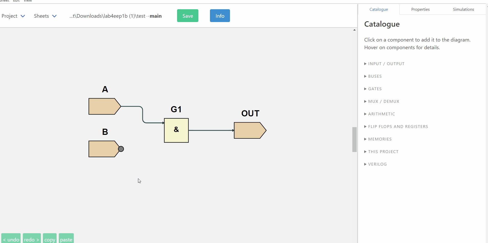

### Simulation

Time to simulate the design and see how the output `OUT` changes as we change the two inputs.

Click the `Simulation` tab which is located on the top-right corner and then `Start Simulation`. Now you can change the value of the two inputs and see how the value of the output. Try all 4 combinations of inputs: 

- A=0, B=0  
- A=0, B=1  
- A=1, B=0  
- A=1, B=1 
   
and check that the output is correct based on the truth table of the AND gate.

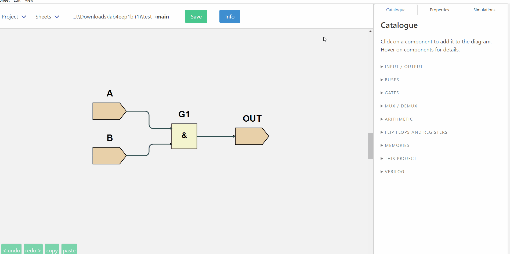

**Well Done!** You just completed your first ISSIE design.  

## Exploiting the ISSIE Features

### A slightly more complex design

This section will exploit the features of ISSIE to create clean and good-looking schematics when making bigger designs.

- Add two more inputs named `C` and `D` each 1-bit.
- Add one OR gate and one 2-input MUX
- Delete the output `OUT`
  - Note: You can delete components and/or wires by selecting them and clicking the `delete` button on your keyboard
- Add a new 1-bit output `RESULT`   
- Make all necessary connections by dragging as before to achieve a diagram like the one bellow:

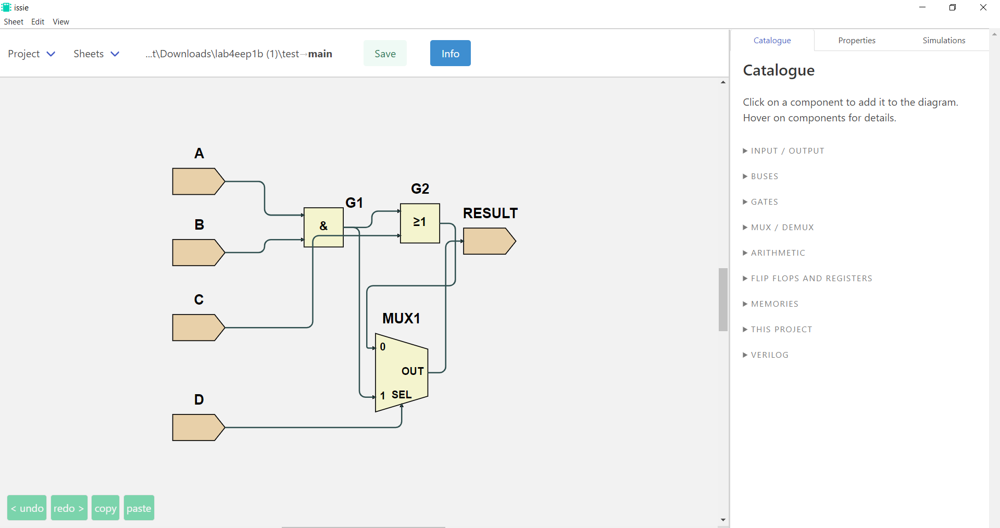

Again, **simulate the design** and check the output remains correct as you change the values of the 4 inputs

### Improving the look of a schematic

The schematic here is not easy to read. **Let's improve it!** The ISSIE canvas is fully customisable to allow the creation of readable and good-looking schematics. Specifically, we can:

1. Rotate, Flip and Move all symbols 
2. Change name and reposition the symbols' *labels* relative to the symbols
3. Manually route any specific segment in a wire
4. Auto-align elements 
5. Select the desired wire type (radiussed, jump or modern wires)

You can view the shortcuts for all these modifications by clicking on the `edit` and `view` menus.

**The improved schematic:**

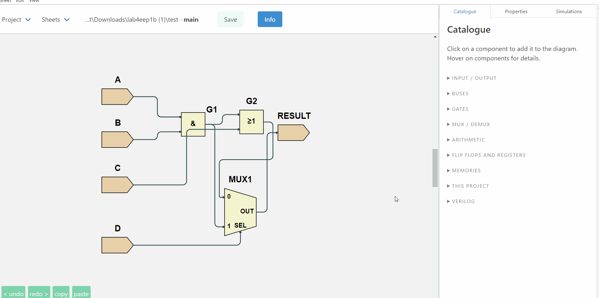

### Summary

- In the `Catalogue` Menu we can find an extensive and complete library of components (gates, flip-flops, RAMs, ROMs, n-bit registers)
- We can add any number of components in our sheet and name them as we like
- When clicking on a port, ISSIE shows us all the ports we can connect that port to: dragging from one port to another makes a wire.
- Wires are initially automatically routed
- Auto-routing can be selectively over-ridden by manual routing to make a better-looking schematic.
- We can simulate our design and check how the outputs change as we change the inputs.

## Using Custom Components

### The root schematic

In this section we will create a hierarchical design with multiple design sheets by using schematics as *custom symbols* in other design sheets. Here is the aim: The design we created earlier can be used in a larger design as a decoder of a 4-bit message to produce a true/false result. Therefore, we are going to create a schematic with an asynchronous-read 4-bit ROM using the schematic we created before as a *custom symbol*. 

#### Steps

1. Change the name of the current sheet from `main` to `decoder` (Sheets -> rename)
2. Add a new sheet and name it `main`
3. Add to the main sheet:
   - Asynchronous ROM (`MEMORIES` => `ROM (asynchronous)`). Select 4 bits addressor, 4 bits data and the `Enter data later` option
   - Your decoder (`THIS PROJECT` => `decoder`)
   - 1-bit output named 'RESULT' (`INPUT/OUTPUT` => `Output`) 
   - 4-bit input named 'Addressor' (`INPUT/OUTPUT` => `Input`) 
4. Using 3 `SplitWire` components (`BUSES` => `SplitWire`) separate the 4-bit ROM output to 4 1-bit wires. (see image below)
5. Make the appropriate connections to achieve the schematic below

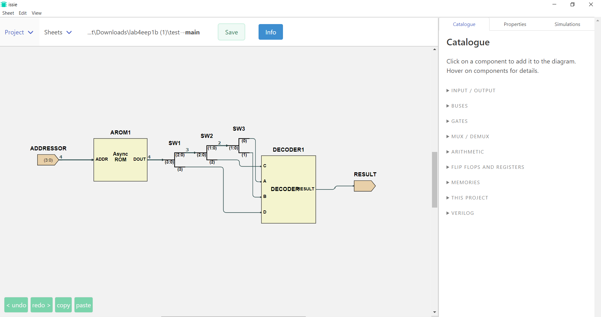

### Improving the design sheet

It's time to use a hidden part of the ISSIE UI to **move ports on custom symbols**. ISSIE allows you to re-order and change the side of input and output ports of custom symbols by `CTRL` + `CLICKING ON THE PORT` you want to move. The UI, once you realise that you must keep `Ctrl` (`Cmd` on Macs) pressed, is intuitive.

Preview how it works in the gif below:

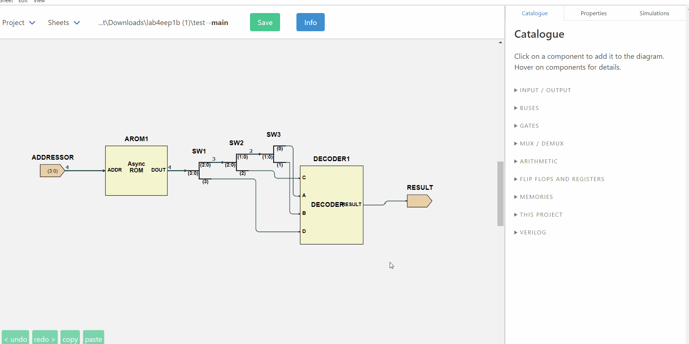

### ROM Initialisation

Currently our ROM is empty as we selected the option `Enter Data Later` before. Let's put some values in our ROM.

1. Select the ROM and click on the `Properties` tab
2. Click on `view/edit memory content`
3. Change the content of the 16 memory location available by assigning a random 4-bit number to each one
4. Click `done`

ISSIE also allows ROM and RAM initialisation via `.ram` text files of hex data in the ISSIE directory. See the ISSIE **Eratosthenes** demo for an example of this. The memory component **properties** tab offers additional options when there  `.ram` files present.

### Simulation

Simulate your design! Change the value of the addressor input and see whether your decoder produces a true or false result for each number you assigned to the ROM. 

## Waveform Simulation

### Creating a clocked design

Let's now modify our previous design to make it **clocked** (sequential). We use a counter to form a custom addressor that will increment every clock cycle. Using the waveform simulator we will be able to view the output of our circuit for all memory locations. In order to create such designs easily, ISSIE offers a `Counter` component which, starting from 0, increments by one every clock cycle. Note that counters also have options, under properties, to add `Load` or `Enable` inputs.

Add a `Counter` from the Catalogue (`FLIP FLOPS AND REGISTERS`). Now select the component and click on `Properties`. In properties remove the `load` and `enable` ports and give them the default functionality (which is what we want in this case): enable=1; load=0;

Edit the previous design to create a schematic like the one below:

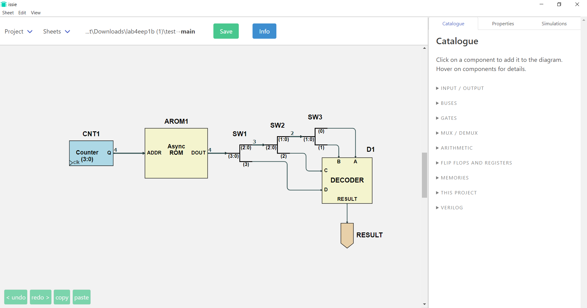

### Simulating your design

As soon as you connect everything correctly, You can simulate your design. Click on `Simulations` and then `Wave Simulation`.

- Click the `Start Simulation` button
- Click `Select Waves`

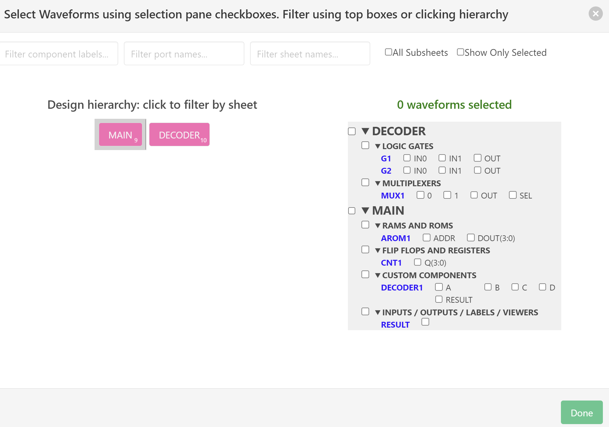

- Click the `Main` breadcrumb to filter so only main sheet ports are visible.

- Select:
  - `AROM1 Addr`
  - `CNT1 Q[3:0]`
  - `DECODER1  RESULT`
- Click `Done`
- To check what you have selected:
  - Click `Select waves again`
  - Click `Show only selected`
  - Click `Done`
- Use `Select RAM` to select the ROM contents to view.
- Change the data format to either `hex` or `bin` to make the waveforms more readable
- adjust the number of clock cycles displayed using the `+/-` zoom controls.
- Order the waveforms `CNT1 / AROM1 / RESULT` by dragging the waveform names up or down.
- Check that the waveform simulator output matches your previous (Step Simulation) results.
- Use the scroll bar to view additional clock cycles.
- Drag the grey horizontal divider to make the waveform display wider or narrower (you can do this at any time).
- You can check how these features work on a much larger design with 100,000 clock cycles using the Eratosthenes sieve demo.

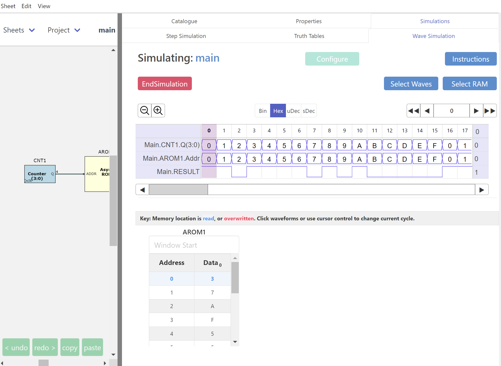

### Changing your design

Now, keeping the simulation open,  add an extra register between the counter and the ROM address (or make any other change you want) and check that the simulation has the expected output. You can see the changes in the waveform simulator by clicking the `Refresh` button which will be enabled as soon as there is a change in the schematic. 

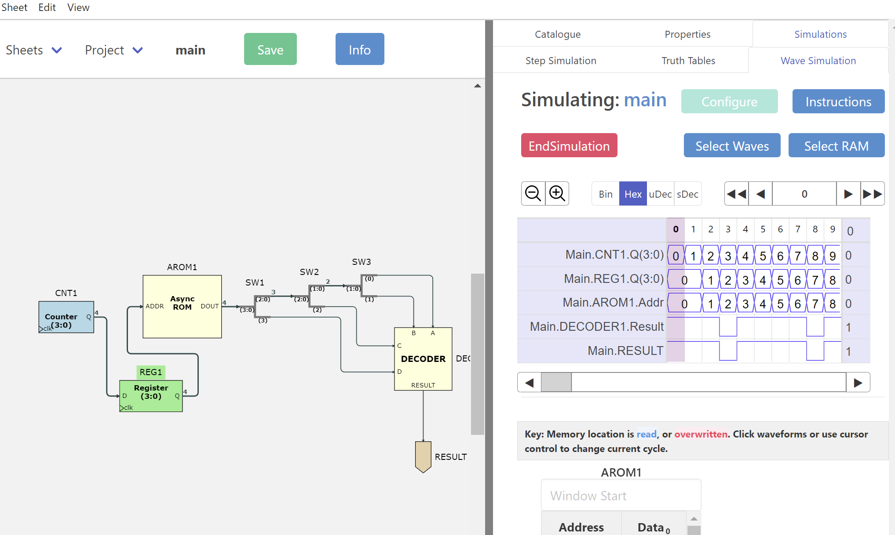

## Truth Table

One of ISSIE's features is the ability to view the truth table for a small combinational circuit. 

- Click on `Simulations` and then `Truth Table`
- Select the `DECODER` component
- Click on `Generate Truth Table` button on the 'Truth Table for selected logic' section
- Click on `Remove Redundancies`
- The truth table should look like this:

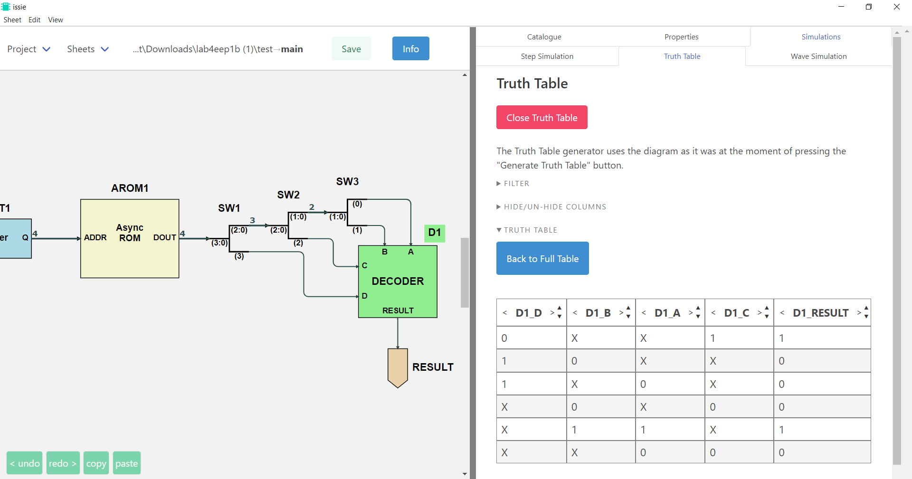

You can also select your inputs to be **algebraic values** to get an expression for each of your outputs.

- Click on `Back to full table`
- Click on `Algebra`
- Select the inputs (`C`, `B`, `A`) you want to be algebraic values
- Truth table should now look like this:

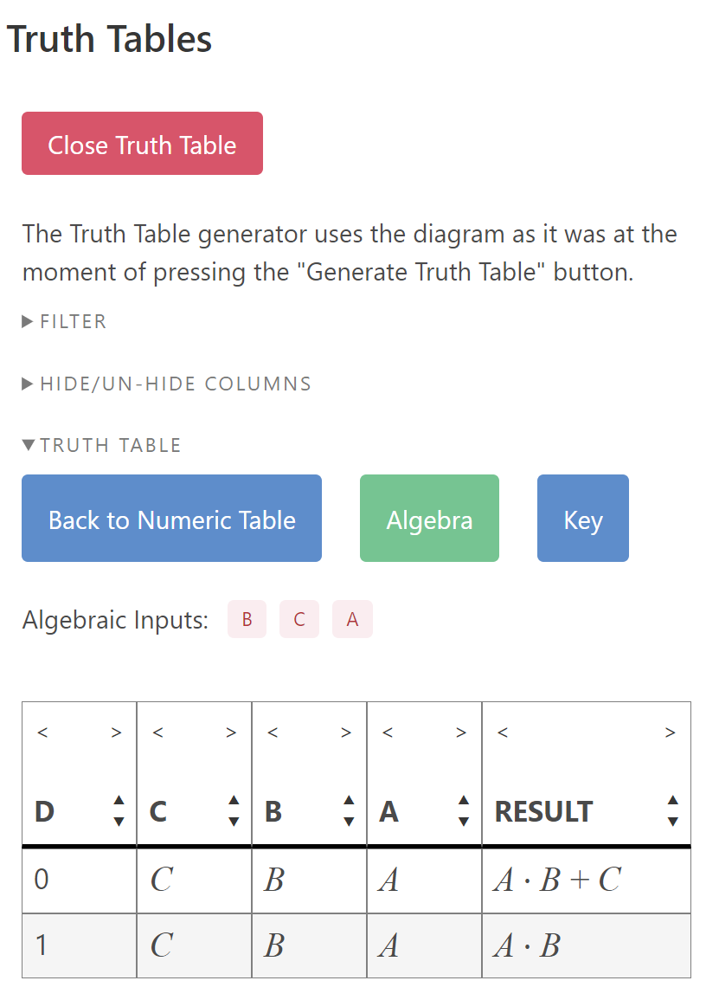

## Verilog Component

Last but not least, ISSIE allows you to create combinational custom components by defining the logic in Verilog. Click on `Verilog` -> `New Verilog Component` (Catalogue) and write the logic of your decoder in Verilog.

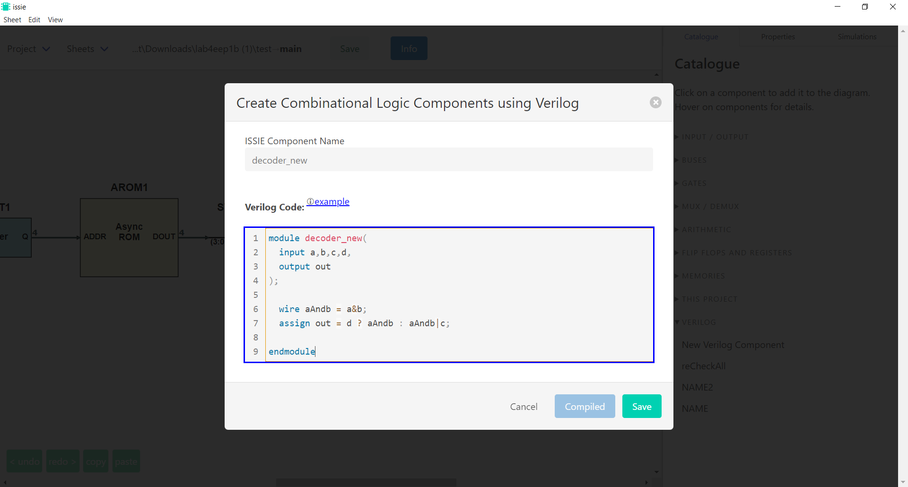

- Click `Save`
- Replace the previous Decoder with the new one (found under `Verilog` section in the Catalogue)
- Simulate again your design. Everything should be the same as before.

## Now what?

You now know how to use ISSIE to create & simulate digital designs. 

You can now create your designs (from simple circuits to fully functioning CPUs) and either simulate them or extract them as Verilog to use them with other tools.

For inspiration, look when you start ISSIE under the **demos** option  for Eratosthenes Sieve demo which consists of an EEP1 CPU running an Eratosthenes Sieve program written in EEP1 assembly language. The sieve occupies most of EEP1 RAM and the program takes 200,000 clock cycles to run.